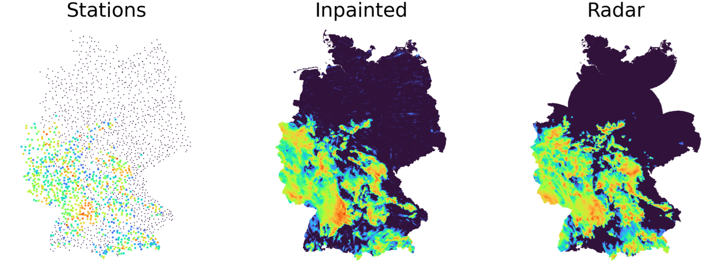

# DDPM Inpainting

This repository contains code for training a Denoising Diffusion Probabilistic Model (DDPM) on radar precipitation data (ground truth) in order to inpainst precipitation station data. 

It was developed as part of a Master's thesis by Merlin Jo Hosak at the FernUniversität in Hagen in 2024/2025. The development of the model as well as the experiment is in detail discussed in the thesis. It is titled "Machine Learning Techniques for Inpainting of Climate Data: A Comparative Study" and is available [here](docs/master.hosak.pdf).

This README provides an overview of the repository structure.

## Repository Structure

- [`src/`](src): The main folder, containg the source code for data processing, model definition, training, and evaluation.
- [`cache/`](cache): Contains cached data, such as preprocessed datasets or evaluation steps.
- [`output/`](output): Contains all output of the model, including all the model run and evaluation outputs.
- [`jobs/`](jobs): Contains all the job scripts for training, data reading and evaluation used to run slurm jobs on the high performance cluster (HPC) of the Potsdam Institute for Climate Impact Research (PIK).
- [`logs/`](logs): Contains all the logs of the model current or cancelled model runs (otherwise they are added to the respective run folder in [output/runs/](output/runs)).
- [`docs/`](docs): Contains the Master's thesis and another thesis that is referenced in the work.

The other files are self-explanatory apart from [`optuna_rain.db`](optuna_rain.db), which is the Optuna database containing the results of the hyperparameter optimization.

The [`README.md`](src/README.md) file in the [`src/`](src) folder contains additional information about the source code structure.